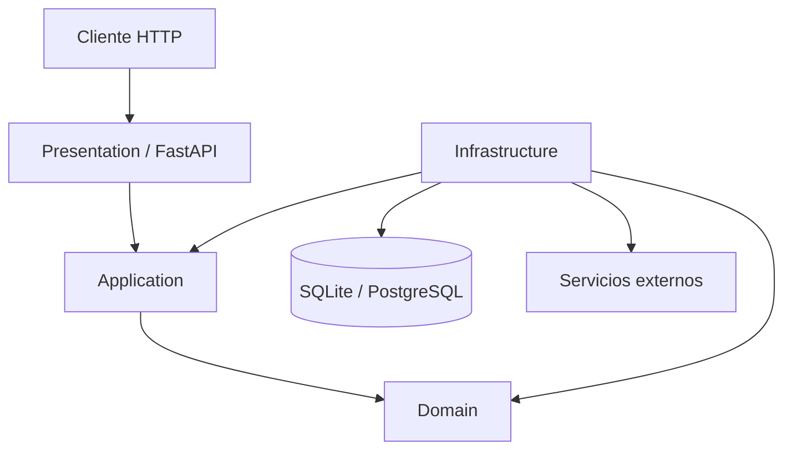
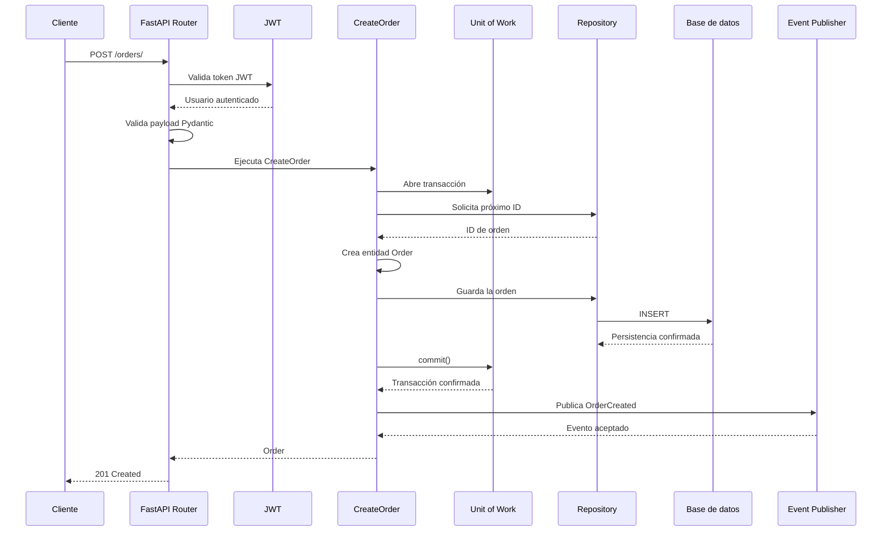
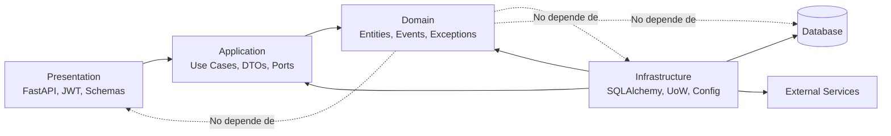
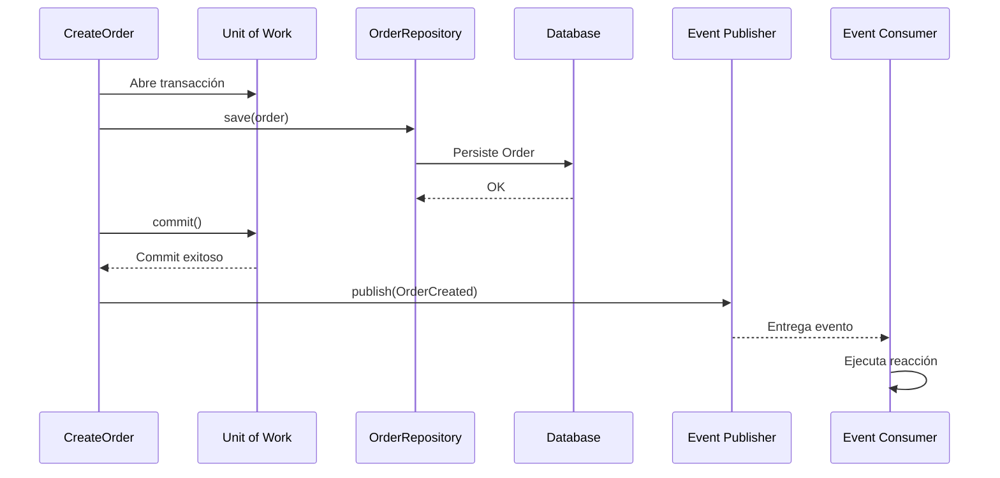
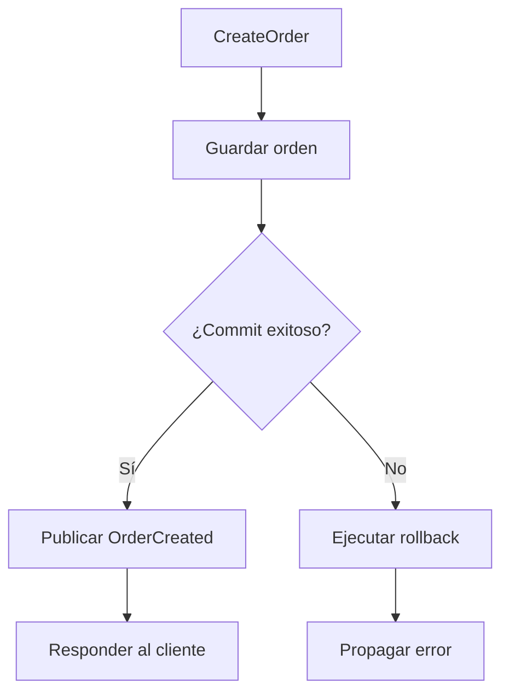
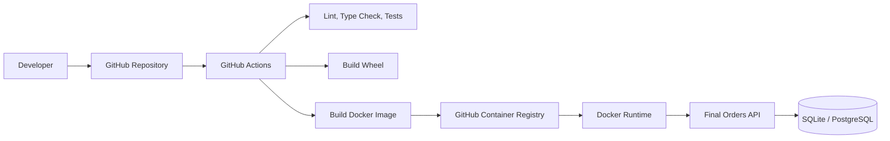
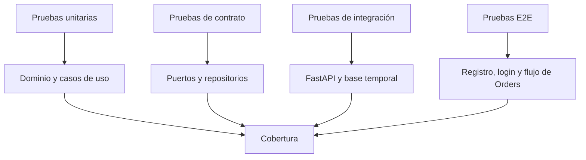

## Diagrama de capas

```mermaid
flowchart TD
    ClienteHTTP["Cliente HTTP"]
    Presentation["Presentation / FastAPI"]
    Application["Application"]
    Infrastructure["Infrastructure"]
    DB[(SQLite / PostgreSQL)]
    ServiciosExternos["Servicios externos"]
    Domain["Domain"]

    ClienteHTTP --> Presentation
    Presentation --> Application
    Infrastructure --> Application
    Infrastructure --> DB
    Infrastructure --> ServiciosExternos
    Infrastructure --> Domain
    Application --> Domain
```

## Flujo de creación de órdenes

```mermaid
sequenceDiagram
    participant Cliente
    participant FastAPI Router
    participant JWT
    participant CreateOrder
    participant Unit of Work
    participant Repository
    participant Base de datos
    participant Event Publisher

    Cliente->>FastAPI Router: POST /orders/
    FastAPI Router->>JWT: Valida token JWT
    JWT-->>FastAPI Router: Usuario autenticado
    FastAPI Router->>FastAPI Router: Valida payload Pydantic
    FastAPI Router->>CreateOrder: Ejecuta CreateOrder
    CreateOrder->>Unit of Work: Abre transacción
    CreateOrder->>Repository: Solicita próximo ID
    Repository-->>CreateOrder: ID de orden
    CreateOrder->>CreateOrder: Crea entidad Order
    CreateOrder->>Repository: Guarda la orden
    Repository->>Base de datos: INSERT
    Base de datos-->>Repository: Persistencia confirmada
    CreateOrder->>Unit of Work: commit()
    Unit of Work-->>CreateOrder: Transacción confirmada
    CreateOrder->>Event Publisher: Publica OrderCreated
    Event Publisher-->>CreateOrder: Evento aceptado
    CreateOrder-->>FastAPI Router: Order
    FastAPI Router-->>Cliente: 201 Created
```

## Dependencias entre capas

```mermaid
flowchart LR
    Presentation["Presentation<br/>FastAPI, JWT, Schemas"]
    Application["Application<br/>Use Cases, DTOs, Ports"]
    Domain["Domain<br/>Entities, Events, Exceptions"]
    Infrastructure["Infrastructure<br/>SQLAlchemy, UoW, Config"]
    Database[(Database)]
    ExternalServices["External Services"]

    %% Conexiones de dependencia directa
    Presentation --> Application
    Application --> Domain
    Infrastructure --> Domain
    Infrastructure --> Application
    Infrastructure --> Database
    Infrastructure --> ExternalServices

    %% Relaciones "No depende de" (líneas punteadas)
    Domain -. "No depende de" .-> Presentation
    Domain -. "No depende de" .-> Infrastructure
    Domain -. "No depende de" .-> Database
```

## Flujo de eventos OrderCreated

```mermaid
sequenceDiagram
    participant CreateOrder
    participant Unit of Work
    participant OrderRepository
    participant Database
    participant Event Publisher
    participant Event Consumer

    CreateOrder->>Unit of Work: Abre transacción
    CreateOrder->>OrderRepository: save(order)
    OrderRepository->>Database: Persiste Order
    Database-->>OrderRepository: OK
    CreateOrder->>Unit of Work: commit()
    Unit of Work-->>CreateOrder: Commit exitoso
    CreateOrder->>Event Publisher: publish(OrderCreated)
    Event Publisher-->>Event Consumer: Entrega evento
    Event Consumer->>Event Consumer: Ejecuta reacción
```

## Flujo de error

```mermaid
flowchart TD
    A["CreateOrder"] --> B["Guardar orden"]
    B --> C{"¿Commit exitoso?"}
    
    C -- "Sí" --> D["Publicar OrderCreated"]
    D --> E["Responder al cliente"]
    
    C -- "No" --> F["Ejecutar rollback"]
    F --> G["Propagar error"]
```

## Diagrama de despliegue

```mermaid
flowchart LR
    Developer["Developer"] --> GitHubRepo["GitHub Repository"]
    GitHubRepo --> GitHubActions["GitHub Actions"]
    
    GitHubActions --> Linting["Lint, Type Check, Tests"]
    GitHubActions --> BuildWheel["Build Wheel"]
    GitHubActions --> BuildDocker["Build Docker Image"]
    
    BuildDocker --> GHCR["GitHub Container Registry"]
    GHCR --> DockerRuntime["Docker Runtime"]
    DockerRuntime --> FinalOrdersAPI["Final Orders API"]
    FinalOrdersAPI --> DB[(SQLite / PostgreSQL)]
```

## Diagrama de pruebas

```mermaid
flowchart TD
    PU["Pruebas unitarias"] --> MCU["Dominio y casos de uso"]
    PC["Pruebas de contrato"] --> PR["Puertos y repositorios"]
    PI["Pruebas de integración"] --> FBT["FastAPI y base temporal"]
    PE2E["Pruebas E2E"] --> RLO["Registro, login y flujo de Orders"]

    MCU --> Cobertura["Cobertura"]
    PR --> Cobertura
    FBT --> Cobertura
    RLO --> Cobertura
```